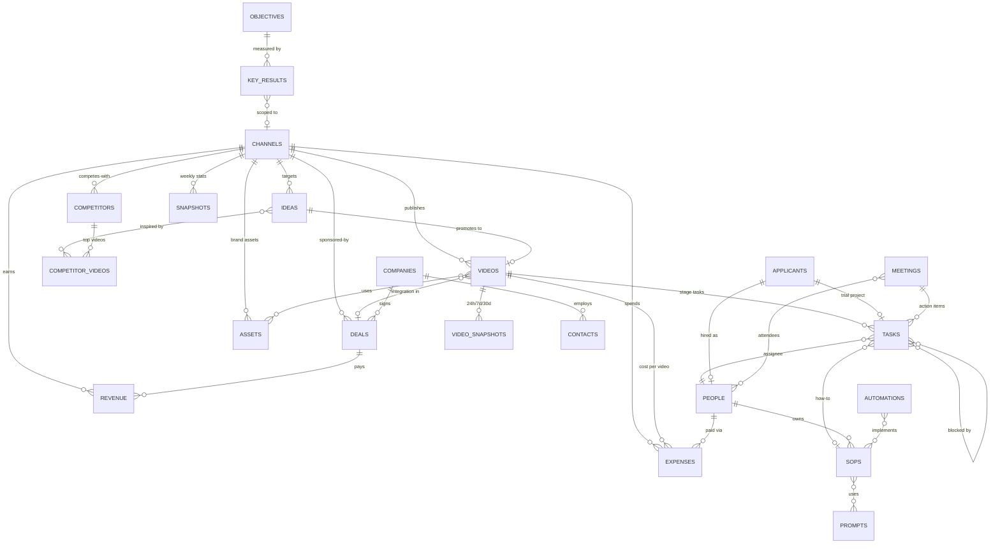

# 02 — Workspace Architecture

## 1. Top-level structure (Notion sidebar)

```
🏛 COMPANY HQ                ← Company dashboard (page)
📊 Analytics Dashboard       ← page of linked views
👤 Role Dashboards
   ├─ 🧠 CEO (Founder 1)
   ├─ 📈 Growth (Founder 2)
   └─ 🎬 Production (Founder 3)
📺 Channels                  ← Channels DB; each row IS the Channel Hub
🗄 DATABASES                 ← the "backend": all 17 source databases live here
   ├─ Ideas, Videos, Tasks, Competitors, Competitor Videos
   ├─ Sponsor Companies, Contacts, Deals
   ├─ People, Applicants
   ├─ SOPs, Prompts, Assets, Knowledge
   └─ OKRs, Key Results, Snapshots, Meetings, Automations, Revenue, Expenses
📚 Libraries (SOPs · Prompts · Assets · Knowledge)   ← curated views of the above
🤝 Meetings
⚙️ Automations Registry
```

**Rule: source databases live in one place (`DATABASES`); every other page shows *linked views* of them.** Nobody ever creates a second "tasks" database. If you need a new slice of data, you create a view, not a database.

### Teamspace evolution

| Stage | Teamspaces |
|-------|-----------|
| 3 founders (now) | One workspace, everything open. Structure below is just pages. |
| ~10 people | `General` (HQ, libraries) · `Production` (videos, tasks, assets) · `Growth` (CRM, deals — private) · `Ops/HR` (people, hiring, pay — private) |
| ~50–100 people | Add one teamspace **per channel** (each contains only linked, channel-filtered views of the same central databases) + `Leadership` (finance, OKRs, scoreboard). |

Pay data, CRM pipeline, and applicant data go into restricted teamspaces at the *first* external hire, not later.

## 2. Relational map (the ERD)



If a property names an entity that has its own database, it MUST be a relation. Text names rot; relations roll up.

## 3. Naming conventions

- **Databases:** plural nouns, emoji prefix: `🎞 Videos`, `💡 Ideas`, `👥 People`.
- **Videos:** `[CH] Title working name` where `CH` is the 2–3 letter channel code (e.g. `[BIZ] The Collapse of Enron`). Channel codes are set on the Channel row.
- **Tasks:** `Stage — Video name` (auto-generated by template), e.g. `Script — [BIZ] The Collapse of Enron`.
- **SOPs:** `SOP-###: Name (vX.Y)`. **Prompts:** `PRM-###: Name (vX.Y)`.
- **Views:** `By Status`, `By Owner`, `This Week`, `⚠️ Overdue` — verbs of slicing, consistent across databases.
- **Statuses:** identical status vocabulary across all databases: `Backlog → Not Started → In Progress → In Review → Blocked → Done → Archived`.

## 4. Documentation standards (mandatory on every database)

Every database's top-level page (and every page template) begins with this callout block:

> **📘 About this database**
> **Purpose:** one sentence — what question does this database answer?
> **Owner:** relation → People (the person accountable for data quality here)
> **Instructions:** how to add a row, what's required, what happens next
> **Examples:** link to 1–2 gold-standard rows
> **Linked SOPs:** relations → SOP Library
> **Related databases:** what feeds this, what this feeds

A database without this block is not "done." The OS audit (monthly, CEO dashboard) lists databases missing documentation.

## 5. AI-first annotation standard

Every SOP and every database doc includes a three-line AI table:

| 🤖 AI does | 👁 Human reviews | 🚫 Never automated |
|-----------|-----------------|--------------------|
| e.g. drafts research brief from PRM-001 | factual accuracy, source quality | final claims in crime/health niches |

See [AI Integration Policy](../ai/ai-integration-policy.md) for the company-wide rules.

## 6. Standard database views (build these everywhere)

| View | Type | Definition |
|------|------|-----------|
| `All` | Table | ungrouped, all properties — the admin view |
| `By Status` | Board | grouped by Status |
| `Mine` | Table | filter: Assignee = @Me |
| `This Week` | Calendar/Table | Due date within this week |
| `⚠️ Attention` | Table | Overdue OR Blocked OR missing required fields |

## 7. Integration points (external tools the OS assumes)

| System | Role | Connects to |
|--------|------|-------------|
| YouTube Analytics API | metrics ingestion | Metrics Snapshots (via Make/Zapier/n8n or custom script) |
| Google Drive / Frame.io | heavy media files | Assets DB stores the *link + license metadata*, never the file |
| Slack | notifications | Automations registry documents every webhook |
| Make / n8n | automation runtime | every scenario has a row in Automations |
| Claude / LLM APIs | drafting engine | every production prompt lives in the Prompt Library |

Notion is the **system of record for work and decisions**; it is deliberately NOT the file store (media) or the BI engine (charts at scale).
